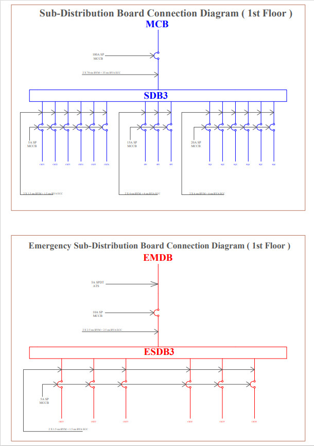

# Electrical-Design-of-a-Multi-storied-Building
Autocad Project

## **Design Steps**
1. Ground floor and typical floor plan of a six-storied building
2. Fittings and fixtures for each floor
3. Conduit layout planning for each floor
4. Switchboard and distribution board diagram
5. Lightning protection system (LPS) design

 
 

## **Floor Plan with Fittings & Fixtures**
 

   
   

   

## **Conduit**
 

   
   

   

## **Wire Rating & Legends**
 

   
   

   

## **Switch Board (SB) Diagram**
 

   
   

   

## **Sub Distribution Board (SDB) Diagram**
 

   
   

   

## **Emergency & Main Distribution Board (MDB)**
 

   
   

   

## **Lightning Protection System**
If the Risk Assessment Factor is greater than 40, lightning protection system is necessary for the building.

 

   

   

 

## **Contributors**
1. Md. Tasnim Azad
2. Mahadi Hassan
3. Samin Zawad
4. Taufiqur Rahman Siddiqui
5. Sabbir Hossain Ujjal
6. Md. Tanveer Aziz Durbar
7. Nahid Ahmed
8. Ashrafia Khanom
